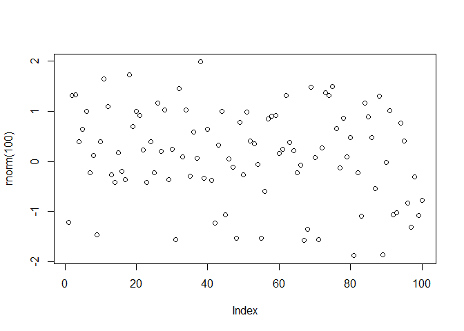

<!-- README.md is generated from README.Rmd. Please edit that file -->

# demopkg

<!-- badges: start -->
<!-- badges: end -->

The goal of ‘demopkg’ is to provide some demostrations of R functions
and vignettes.

## Installation

You can install the development version of demopkg from \[Github\]
(<https://github.com/julia-pantin/demopkg>) with:

``` r
devtools::install_github("https://github.com/julia-pantin/demopkg")
```

## Example

This is a basic example which shows you how to solve a common problem:

``` r
library(demopkg)

M <- make_data()
```

use this code like this …

``` r
plot(rnorm(100))
```



You’ll still need to render `README.Rmd` regularly, to keep `README.md`
up-to-date. `devtools::build_readme()` is handy for this. You could also
use GitHub Actions to re-render `README.Rmd` every time you push. An
example workflow can be found here:
<https://github.com/r-lib/actions/tree/v1/examples>.

You can also embed plots, for example:


In that case, don’t forget to commit and push the resulting figure
files, so they display on GitHub and CRAN.
